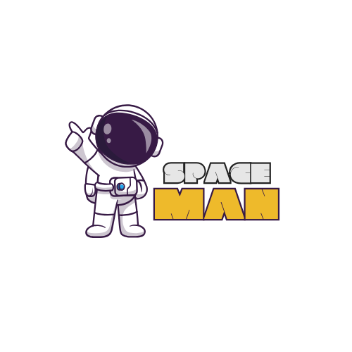

 

 ## 🎮 Game Description

*Spaceman* is a word-guessing game where players try to guess the **secret word** before they run out of chances. Each incorrect guess brings the **spaceman closer to being lost in space**. The player wins if they successfully guess all the letters before their chances run out.
This game was inspired by **classic word puzzle games** but with a fun **space-themed twist** to make it visually engaging. I chose this game because I've always loved word-guessing games since childhood, and recreating it brought a sense of nostalgia.

## 🚀 Getting Started

#### Play the Game Here: [Spaceman Game](https://shakieraearvin.github.io/Spaceman-Game/)

#### 🛠 How to Play
1. Click on a **letter** to guess if it is part of the secret word.
2. If the letter is **correct**, it will appear in the word.
3. If the letter is **incorrect**, the spaceman image will change, indicating the number of chances left.
4. You have **9 chances** to guess the correct word.
5. **Win** by completing the word before you run out of chances.
6. If you **lose**, the correct word is revealed, and you can restart the game.

## 🔗 Attributions

* **Font**: ["New Amsterdam"](https://fonts.google.com/specimen/New+Amsterdam)
* **Color Palette**: [Spaceman Color Palette](https://paperheartdesign.com/blog/color-palette-awesome-space)
* **Images**: [Spaceman Images](https://www.freepik.com/free-photos-vectors/spaceman)
* **References** 
    * [W3Schools](https://www.w3schools.com/js/default.asp)
    * [Stack Overflow](https://stackoverflow.com/questions/6764961/change-an-image-with-onclick)
    * [MDN](http://MDN.com)
    * [Google](www.google.com)

## 🛠 Technologies Used

* **HTML** – Structuring the game layout
* **CSS** – Styling and making it responsive
* **JavaScript** – Game logic, event handling, and interactivity
* **WCAG 2.0 Compliance** – Accessibility improvements
* **Responsive Design** – Optimized for *desktop and mobile*

 ### Next Steps & Planned Enhancements

1. **Animations:** Add smooth transitions when letters appear or the spaceman image updates.
2. **Sound Effects:** Play sounds for correct/incorrect guesses and when the game is won or lost.
3. **More Word Categories:** Allow users to pick different word themes (e.g., space, animals, tech).
4. **Multiplayer Mode:** Add an option for two players to take turns guessing words.

